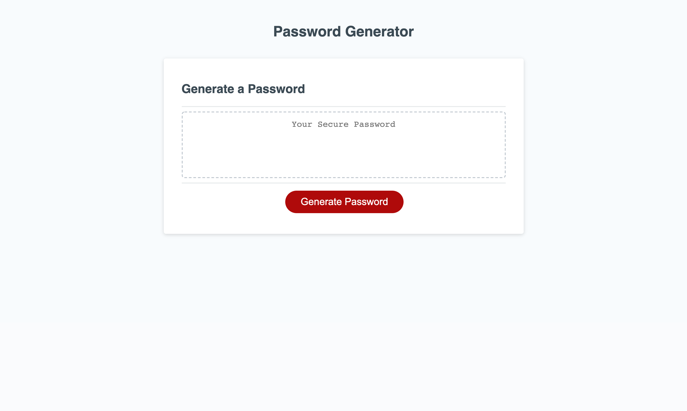

# Password Generator Starter Code
I recieved the layout for a password generator and designed the necessary javascript function to generate a password of a user defined length with inclueded character types (lowercase, uppercase, numeric, or special) also defined by the user.  The user inputs are validated and new input will be requested if input is invalid.

## Deployed Page
https://paulkup.github.io/passwordGenerator/
## Finished Application
